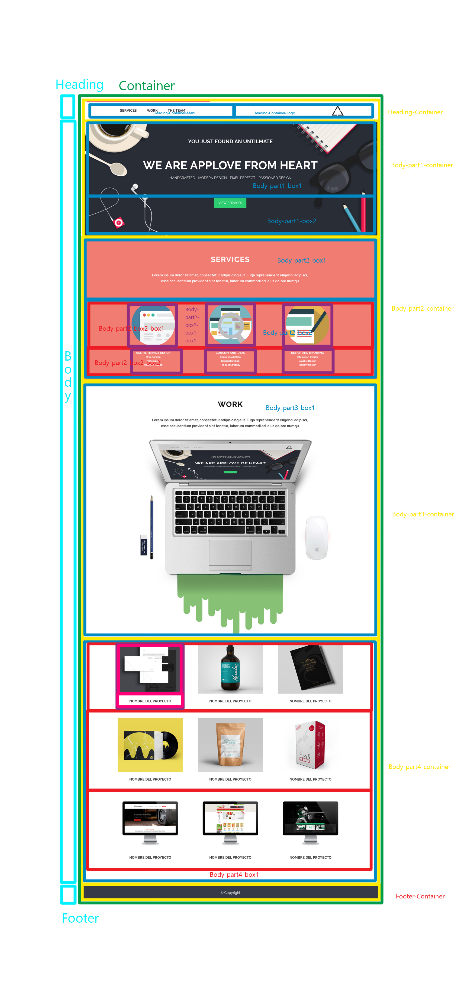

# AppLove

* **Track:** _Common Core_
* **Curso:** _Creando tu primer sitio web interactivo_
* **Unidad:** _Maquetado web con HTML & CSS_

***
La página web está contenida en un container general que a su vez está dividido en tres partes principales: Heading, Body y  Footer.

Dentro el Heading está el container, y el container del menú y el logo. El menú está realizado con <li>.   

El body está dividido en cuatro partes. Dentro de la primera parte tenemos la imagen, la box 1 en la que se encuentra el texto y la box 2 donde están el botón. Dentro de la seguna parte se encuentra el container, la box 1, donde se encuentra el texto  y la box 2 donde se realizó una grid para eliminar la necesida de colocar más container anidados. Ésta parte está creada por medio de dos grids, una que coloca las imágenes y otra que coloca los textos. La tercera parte, tiene dentro de su container 2 boxes, una contiene el texto y otra la imagen. La cuarta parte únicamente consta de un container en el que se introdujo un grid.  Finalmente el footer únicamente consta de su propio container. 

##Diagrama de boxes

